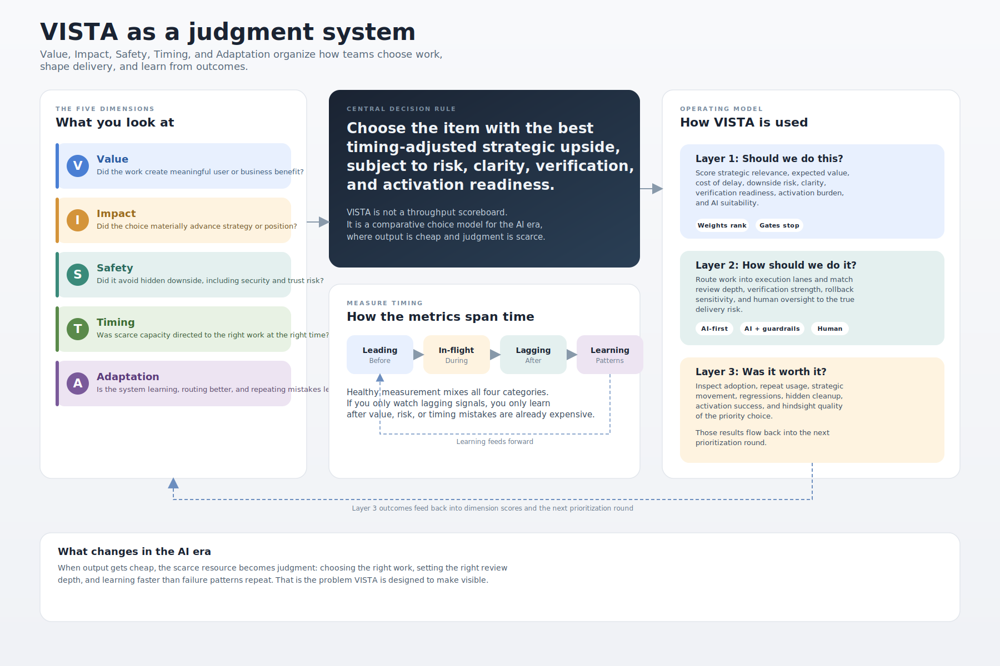
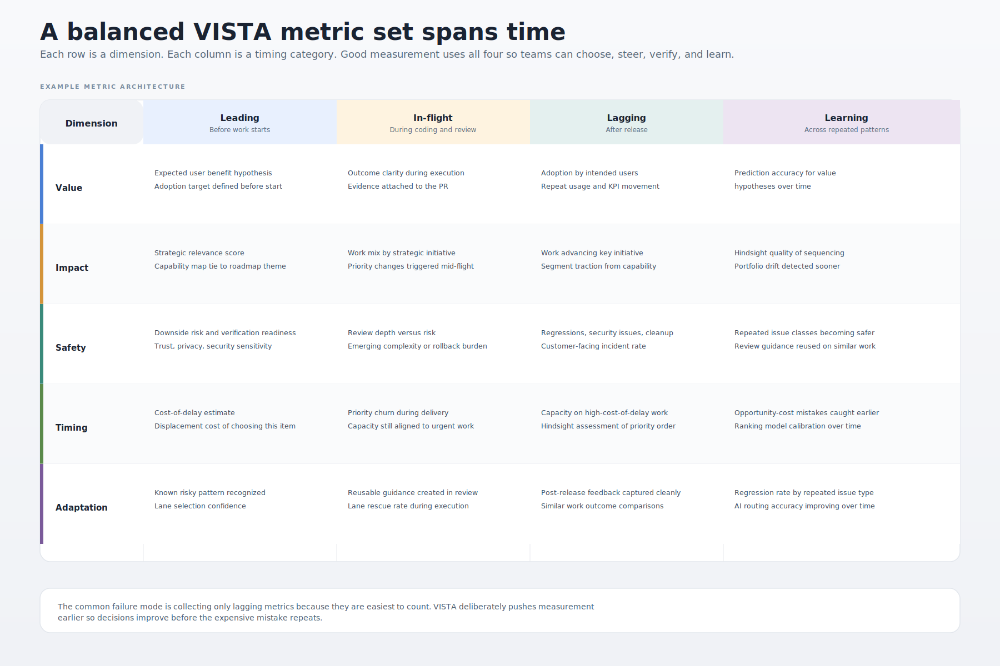
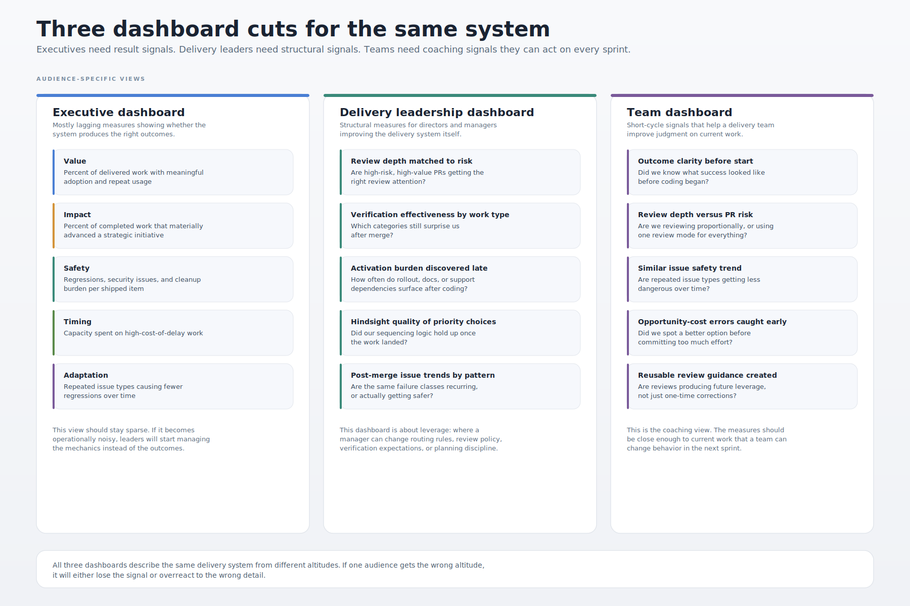

# VISTA : The Big Picture for Outcome-Optimized AI Engineering

**VISTA** stands for **Value, Impact, Safety, Timing, and Adaptation**.

VISTA is an open framework for outcome-optimized AI engineering. It gives leaders and teams an overall view of whether engineering is producing the right outcomes, not just more code, more pull requests, or more shipped changes.

As coding gets cheaper and faster, the real constraint shifts from code production to judgment: choosing the right work, shaping it well before coding starts, applying the right review depth, verifying the right risks, and learning from what happens after release.

That is the purpose of VISTA.

---

## Why VISTA exists

Modern engineering organizations have no shortage of output metrics.

They can usually tell you:
- how many pull requests were merged
- how often software was deployed
- how fast reviews moved
- how much code was generated
- how much backlog was cleared

What they often cannot tell you is whether that work:
- advanced strategy
- created real customer value
- avoided hidden downside
- went to the right place at the right time
- helped the organization learn and improve

VISTA exists to make that visible.

## Complexity with purpose

Yes, VISTA is more nuanced than lighter-weight frameworks.

That is intentional.

A simple metrics set can spread quickly because it is easy to explain. But engineering in the age of AI needs more than a narrow view of speed and stability. It needs a better overall view of direction, value, risk, timing, and learning.

**Speed without direction is waste.**  
**Output is not outcome.**  
**Complexity with purpose is better than simplicity that hides what matters.**

VISTA is designed to be richer where it needs to be, while still being practical enough to start small and grow over time.

## The five dimensions

### Value
Did the work create meaningful user or business benefit?

### Impact
Did it materially advance strategic goals or competitive position?

### Safety
Did it avoid hidden downside, including regressions, security failures, privacy issues, trust damage, or fragile outcomes? In VISTA, **Safety explicitly includes security**. The S stays Safety, but the dimension covers whether work avoids regressions, security failures, privacy issues, trust damage, and other hidden downside.

### Timing
Was capacity directed to the right work at the right time, especially where cost of delay was highest?

### Adaptation
Is the system learning and improving over time?



## What VISTA is trying to change

VISTA is built on a simple idea:

**As AI makes output cheaper, judgment becomes more important.**

That means teams need better ways to think about:
- choosing the right work
- avoiding low-value output
- matching review depth to risk
- accounting for hidden delivery costs
- preventing AI slop in code, pull requests, and product direction
- connecting measures to real business outcomes

VISTA is not a celebration of activity. It is a discipline for better decisions under accelerating output.

## The VISTA decision rule

The right next item is not the loudest item, the easiest item, or even always the item with the highest apparent value.

It is the item with the best **timing-adjusted strategic upside**, subject to acceptable downside risk, sufficient clarity, and realistic verification and activation readiness.

## [ODIM](docs/odim.md)

One of the ways VISTA teaches metric design is through **ODIM**, credited to Larry Maccherone:

- **Outcome**
- **Decision**
- **Insight**
- **Measure**

ODIM helps teams make sure their measures connect to the business outcomes they want, rather than floating as isolated output counters.

In practice, teams often move in both directions:
- **ODIM** when designing measurement from desired outcomes
- **MIDO** when starting from existing measures and working backward to test whether they connect to real outcomes

## Who this is for

VISTA is for:
- CTOs and engineering leaders
- product and platform leaders
- AI engineering teams
- organizations trying to avoid AI slop
- teams drowning in pull requests or feature requests
- companies trying to connect engineering work to strategy and customer outcomes

It is especially relevant for organizations that are discovering a new problem:

AI can help them build more, but it does not automatically help them build the right things, safely and securely, at the right time, with the right follow-through.

## Repo structure

```text
AGENTS.md
LICENSE
README.md
docs/
  ...
images/
  ...
kits/
  01-strategy-vision-impact/
    README.md
    agent-files/
      ...
    community/
      ...
    prompts/
      ...
    questions/
      ...
    skills/
      ...
    surveys/
      ...
    templates/
      ...
    theory/
      ...
    ...
  ...
prior-art/
  ...
principles/
  ...
```

- `docs/` holds the core framework documentation: dimensions, decision model, scoring, profiles, and dashboards.
- `images/` holds diagrams and the visual style guide for SVGs and other repo visuals.
- `kits/` holds applied, reusable working packages. Each numbered kit has its own README plus prompts, surveys, templates, theory, skills, questions, community materials, and any supporting agent files.
- `prior-art/` holds related frameworks and reference material that informed VISTA.
- `principles/` holds the ten principles and the overview that ties them together.

The goal of this repo is to make the framework:
- understandable
- discussable
- evolvable
- usable in real organizations
- easy to extend through articles, examples, diagrams, and tooling

## Start here

If you are new to VISTA, start with:

1. [Prior art](prior-art/README.md) — the frameworks and ideas VISTA builds on
2. [The five dimensions](docs/README.md) — Value, Impact, Safety (including security), Timing, Adaptation
3. [The principles](principles/README.md) — the ten ideas that shape how VISTA thinks
4. [ODIM](docs/odim.md) — Larry Maccherone's Outcome, Decision, Insight, Measure framework for designing metrics that connect to outcomes
5. [The decision model](docs/decision-model.md) — how to choose, shape, and evaluate work

Then go deeper: [scoring template](docs/scoring.md), [team profiles](docs/profiles.md), and [dashboards](docs/dashboards.md).

## Core idea in one sentence

**VISTA gives leaders and teams an overall view of whether AI engineering is creating value, advancing strategy, managing hidden risk, prioritizing well, and improving over time.**

## Metrics and Dashboards





## Contributing

This repo is intended to be open, discussable, and useful.

Good contributions include:
- clarifications to the framework
- examples from real teams
- diagrams and teaching aids
- critiques and counterexamples
- case studies
- scoring patterns
- templates for implementation

The goal is not to make VISTA rigid.
The goal is to make it useful.

## Delivery Tower

VISTA is the theory behind [Delivery Tower](https://deliverytower.com), a product that implements these ideas as working software. Delivery Tower provides three towers:

- **Delivery Tower** — Assess incoming work against strategic fit, verification readiness, change-surface risk, and hidden follow-on cost. Route to the right execution lane.
- **PR Tower** — Prioritize pull request review by delivery value, not arrival time. Surface similar-work recommendations from historical patterns.
- **AI Adoption Tower** — Prove that AI delivery is getting better, not just bigger. Track balanced adoption, safe and secure execution, and lane accuracy.

VISTA provides the framework and thinking. Delivery Tower provides the tooling.

## License
 Apache 2.0 for broad adoption and implementation.

---

## Final thought

AI makes output easier.

That does not mean engineering performance is improving.

VISTA exists to help teams see whether the movement was worth it.


